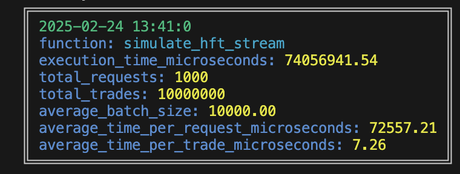

<h1 align="center">Welcome to financial-data-service 👋</h1>
<p>
  
</p>

> 📈 High-Performance Financial Data Service
⚡️ Real-time Stats | 📊 O(1) Retrieval | 🔄 Streaming Data

## Prerequisites

Before running the project, ensure you have the following installed on your system:

- Python 3.13 (`python3 --version`)
- Poetry (`poetry --version`)
- Make (`make --version`)
  **Optional:**
- tmux
- htop
  
### Installation
1. Make sure the project is copied to a known folder on your PC

2. Set up Python environment
```sh
make shell # Creates a pyenv virtualenv with Python 3.13
```
3. Install dependencies
```sh
make install # Installs all required packages using Poetry
```


### Running the Service
1. Start the FastAPI server
```sh
make run # Starts server on http://localhost:8000
```
This will start the FastAPI app running off an asgi uvicorn server.
However, we need to interact with it. In that respect, you can find some scripts in the scripts
folder. 
- The first one mocks asynchronous stream of high-frequency **/add_batch** POST requests.
- The second one will start randomly sending GET requests to the **/stats** endpoint

2. Send test data (in a new terminal)
```sh
make batches # Sends random trade data
```
3. Query statistics (in a new terminal)
```sh
make stats # Queries random statistics
```
4. View the monitoring UI (in a new terminal)
```sh
make monitor-ui # Opens Streamlit UI on http://localhost:8501
```
### Alternative: Start Everything at Once
You can also use command
```sh
make start-all
```

which will start a tmux session (as long as you have already installed it, check Prerequisites).
in a quadrant setup.
- Top-left: FastAPI server **(make stats)**
- Top-right: Get stats **(make stats)**
- Bottom-left: Post batches **(make batches)**
- Bottom-right: Htop monitor **(make monitor)**

{width=600px}

Run this script to give your mouse control of tmux:
```sh
tmux source-file .tmux.conf
```
## Testing

### Current Test Coverage
The test suite covers:
1. Unit Tests (`tests/`)
   - `test_running_stats.py`: Tests statistical calculations
   - `test_symbol_manager.py`: Tests symbol management operations
   - `test_exceptions.py`: Tests error handling
   - `test_endpoints.py`: Tests API endpoints

2. Load Testing Scripts (`scripts/`)
   - `test_hft_stream.py`: Simulates high-frequency trading data ingestion
   - `test_stats_stream.py`: Simulates concurrent stats retrieval

### Run All Tests
```sh
make test
```
### Run Tests with Coverage
```sh
make test-cov
```
{width=600px}

### Run Specific Test Method
```sh
make test-method file=test_running_stats.py method=test_running_stats_initialization
```
### Run Specific Test File
```sh
make test-file file=test_running_stats.py
```


## ARCHITECTURE
```

Compact version:
┌─────────┐    ┌─────────┐    ┌─────────────┐
│ Client  │───▶│ FastAPI │───▶│SymbolManager│
└─────────┘    └─────────┘    └─────┬───────┘
                                    │
                              ┌─────┴──────┐
                              │RunningStats│
                              └────────────┘
```

```

More detail:

┌──────────────┐     ┌─────────────────┐     ┌──────────────┐
│   Client     │────▶│  FastAPI Server │────▶│SymbolManager │
└──────────────┘     └─────────────────┘     └──────────────┘
                            │                        │
                            │                  ┌─────┴────────┐
                            │                  │              │
                     ┌──────┴──────┐     ┌─────┴──────┐  ┌────┴────┐
                     │Input Models │     │RunningStats│  │  Deque  │
                     │(Validation) │     │(k=1...8)   │  │Windows  │
                     └─────────────┘     └────────────┘  └─────────┘

Data Flow:
POST /add_batch/ ──▶ BatchData ──▶ SymbolManager ──▶ RunningStats[k] ──▶ Deque
GET /stats/{k}   ◀── Stats    ◀── O(1) lookup  ◀── Pre-calculated
```

#### SymbolManager
Main service class managing trading data for multiple symbols.

**Time Complexity:**
- add_batch: O(b * k) where:
  - b is the batch size (max 10000)
  - k is the number of window sizes (constant: 8)
  Therefore, effectively O(b) for each batch

- get_stats: O(1) - constant time retrieval of pre-calculated stats

**Space Complexity:**
- O(s * k * w) where:
  - s is number of symbols (max 10)
  - k is number of window sizes (constant: 8)
  - w is largest window size (10^8)
  Therefore, O(10 * 8 * 10^8) = O(8 * 10^9) in worst case

**Design Decisions:**
1. Pre-calculate statistics for all window sizes on insertion
   - Trades more space for constant-time stats retrieval
   - Suitable for read-heavy workloads

2. Use deque with maxlen for each window
   - Python's deque provides O(1) append and pop from left side without shifting N samples
   - Automatically maintains fixed size (drops old values when maxlen reached)
   - Thread-safe for individual operations

3. Separate RunningStats instance per window size
   - Allows parallel processing if needed
   - Simplifies stats calculation logic

#### RunningStats
Statistics calculator for a fixed-size window of values.

**Time Complexity:**
- add: O(1) - constant time insertion and stats update using deque
- get_stats: O(1) - constant time retrieval of pre-calculated stats

**Space Complexity:**
- O(w) where w is the window size (stores only the last w values in deque)

### System Constraints / Performance Characteristics
- Maximum 10 unique symbols
- Batch size limit: 10000 values
- Window sizes: 10^k where k is 1-8
- In-memory storage only
- No concurrent requests for the same symbol

**Memory Usage (float32 values)**
Per Symbol Memory:
- k=1: 10¹ values = 40 bytes
- k=2: 10² values = 400 bytes
- k=3: 10³ values = 4 KB
- k=4: 10⁴ values = 40 KB
- k=5: 10⁵ values = 400 KB
- k=6: 10⁶ values = 4 MB
- k=7: 10⁷ values = 40 MB
- k=8: 10⁸ values = 400 MB
Total per symbol: ~444.45 MB
Maximum (10 symbols): ~4.5 GB

### Throughput

**add-batch**
- Batch Processing: 7&micro;s per get stats request for random sized windows from k=1...8, but 1 sample per batch costly (800&micro;s to 6ms)
- As we increase the batch size, we can fit in more trades within a certain time window
- Requests overhead penalty

|  |  |
|:---:|:---:|
| batch-size: 1 / num of requests: 1 | batch-size: 1 / num of requests: 1000 |
|  |  |
| batch-size: 1000 / num of requests: 1000 | batch-size: random / num of requests: 1000 |


**stats**
- Batch Processing: 7ms per stats request, 1000 async requests
{width=300px}


## Monitoring with Streamlit
You have the ability to observe the stats and window sizes progression in Streamlit, which
we spawn on default **localhost:8501**. To do so first make sure you have your server running and
some batch requests been sent:

```sh
make run
make batches
```
Then you can start monitoring:

```sh
make monitor-ui
```

then go [here](http://localhost:8501 "streamlit")

and you should see something like this:
{width=1000px}

## API Endpoints
- `POST /add_batch/`: Add a batch of trading data.
- `GET /stats/`: Retrieve statistics for a symbol.

### Access the API:
- Swagger UI: http://localhost:8000/docs
- ReDoc: http://localhost:8000/redoc

{width=600px}
{width=600px}

## Project Structure
```
financial-data-service/
├── src/
│   ├── __init__.py
│   ├── main.py          # FastAPI application
│   ├── models.py        # Pydantic models
│   ├── services.py      # Business logic (SymbolManager, RunningStats)
|   |...
├── tests/
│   ├── __init__.py
│   ├── test_main.py     # Tests for the FastAPI endpoints
│   ├── test_services.py # Tests for the business logic
|   |...
├── .gitignore
├── Makefile
├── poetry.lock
├── pyproject.toml
├── ...
└── README.md
```
## Author

👤 **Nicolas Markos**

* Github: [@markonick](https://github.com/markonick)
* LinkedIn: [@Nicolas Markos](https://www.linkedin.com/in/nicolas-markos-54865211/)

## Show your support

Give a ⭐️ if this project helped you!

***
_This README was generated with ❤️ by [readme-md-generator](https://github.com/kefranabg/readme-md-generator)_